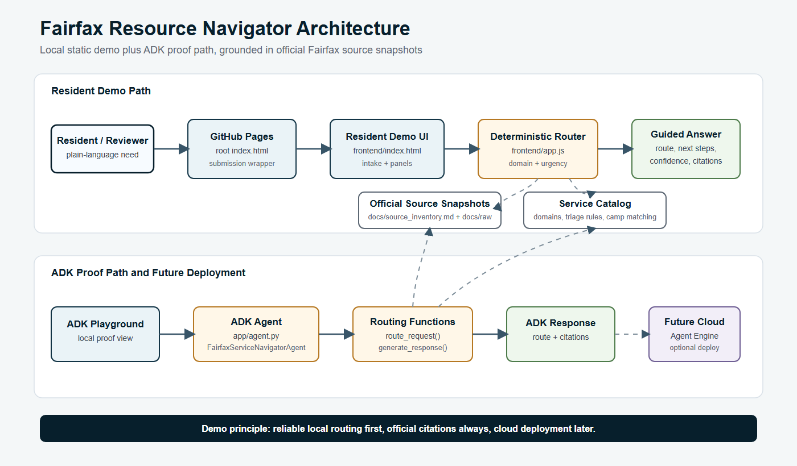
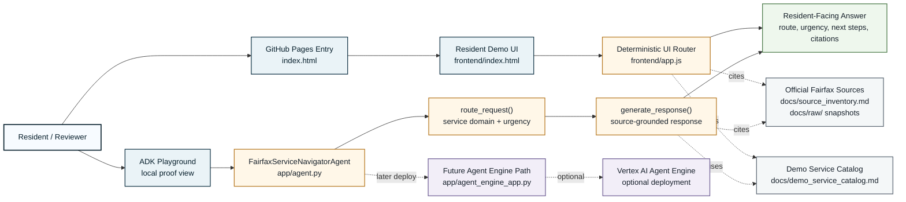
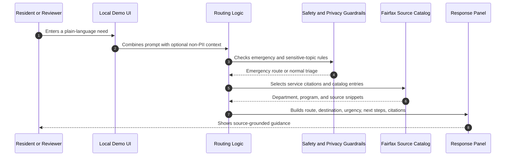
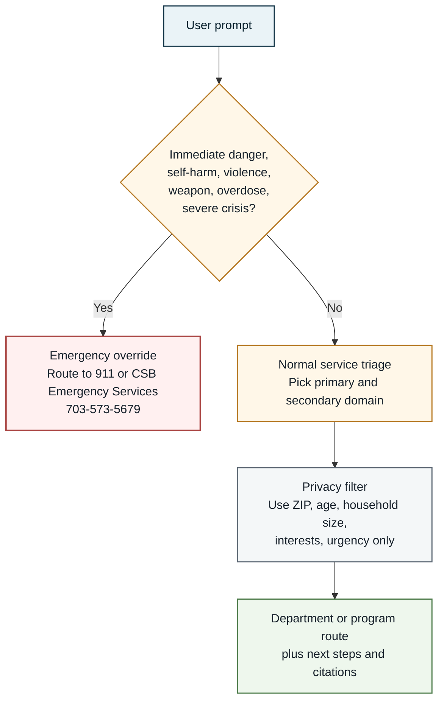

# Fairfax Resource Navigator Demo Architecture

Date: 2026-05-15

## Purpose

Fairfax Resource Navigator is a local Google ADK demo that shows how a civic service-routing assistant could help staff or residents identify the right Fairfax County service path. The demo prioritizes reliability, privacy, official-source citations, and human escalation over autonomous decision-making.

## Current Architecture

The current demo has two working local paths: a static resident UI for fast review, and an ADK proof path that exercises the same routing logic inside the Google ADK agent structure. The cloud deployment path is scaffolded but intentionally not required for review.

## Request Flow

## Runtime Behavior

- The local resident UI runs from `frontend/` and performs deterministic routing in `frontend/app.js`.
- The ADK agent runs deterministic routing in `app/agent.py`.
- The demo does not call OpenAI, Gemini, Gemma, or any live model API during normal chat.
- Vertex Agent Engine scaffolding exists for later deployment, but the current demo can be reviewed locally without cloud deployment.

## Service Routing Layer

The routing layer maps plain-language resident prompts into primary service domains:

- Housing and basic needs
- Taxes and revenue
- Health and human services
- Parks, recreation, and youth
- Land use, permits, and code
- Public works and utilities
- Transportation
- Public safety

Each route includes:

- Destination department or program
- Urgency guidance
- One or more next steps
- Official Fairfax County or Fairfax-hosted citation snippets

## Camp Matching

Camp questions use a small official-demo catalog and score by:

- Child age
- Interests
- Location preference
- Budget or affordability concern

The demo explicitly explains why a camp is recommended. For example, STEM/robotics/coding interests route toward STEM Robo-Creators, while affordability concerns boost Rec-PAC.

## Emergency And Safety Handling

The emergency override routes severe crisis language to 911 or CSB Emergency Services at `703-573-5679`. Trigger terms include violence, self-harm, suicide, weapon, overdose, severe crisis, and immediate danger.

The assistant should not continue ordinary triage when an emergency override is triggered.

## Privacy Model

The demo does not need names, exact home addresses, account numbers, Social Security numbers, or other sensitive identifiers.

Allowed low-risk routing context:

- ZIP code
- General neighborhood or cross street
- Age range or child age
- Household size
- Approximate income range
- Service interests
- Timing or urgency

## Data And Sources

The demo uses local source metadata and snapshots in:

- `docs/source_inventory.md`
- `docs/raw/`
- `docs/demo_service_catalog.md`

The source strategy is official-public-source-first. The demo avoids live eligibility, permit, tax, shelter placement, legal, or medical determinations.

## Deployment Path

The repo was created from the Google ADK starter pack with an Agent Engine deployment target. Deployment is intentionally not required for the demo because cloud setup can take longer than the review window.

Recommended sequence:

1. Review the local UI and ADK playground.
2. Review `FINAL_SUBMISSION_ONE_PAGER.md`.
3. Run local tests that do not require cloud credentials.
4. Run a secret scan.
5. Initialize Git and connect the GitHub remote.
6. Push only after review.

## Known Limits

- No live camp seat availability or registration search.
- No live backend endpoint connecting the static UI to the ADK agent yet.
- No production retrieval index over every raw source file yet.
- Full test suite requires Google Application Default Credentials because the Agent Engine integration test imports the Vertex wrapper.

## Review Checklist

- Confirm the one-pager accurately describes the demo.
- Confirm the service catalog matches the intended Fairfax routing categories.
- Confirm the logo/branding is acceptable for a prototype.
- Confirm no real API keys or credential files are present before GitHub push.
- Confirm whether to initialize Git and connect `https://github.com/AICertGit/FairfaxCountyNevigator.git`.
